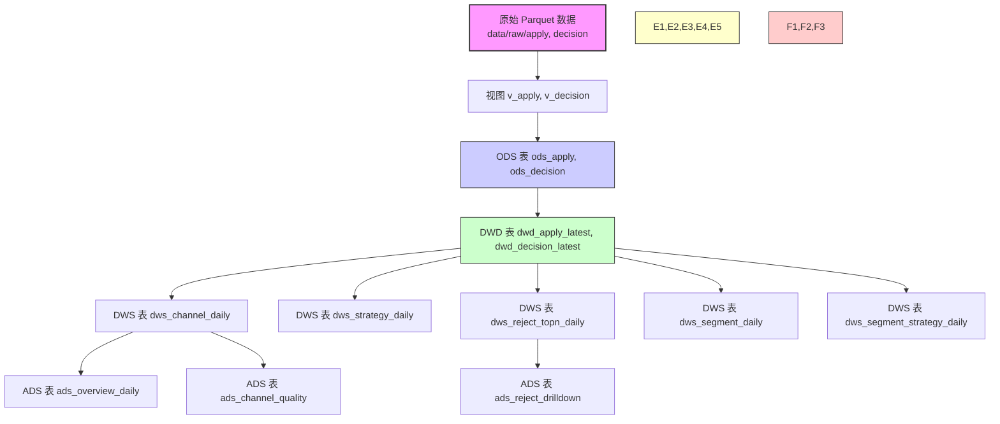

# 数据血缘图


```mermaid
graph TD
    A[原始 Parquet 数据<br/>data/raw/apply, decision] --> B[视图 v_apply, v_decision]
    B --> C[ODS 表 ods_apply, ods_decision]
    C --> D[DWD 表 dwd_apply_latest, dwd_decision_latest]
    D --> E1[DWS 表 dws_channel_daily]
    D --> E2[DWS 表 dws_strategy_daily]
    D --> E3[DWS 表 dws_reject_topn_daily]
    D --> E4[DWS 表 dws_segment_daily]
    D --> E5[DWS 表 dws_segment_strategy_daily]
    E1 --> F1[ADS 表 ads_overview_daily]
    E1 --> F2[ADS 表 ads_channel_quality]
    E3 --> F3[ADS 表 ads_reject_drilldown]

    style A fill:#f9f,stroke:#333,stroke-width:2px
    style C fill:#ccf,stroke:#333
    style D fill:#cfc,stroke:#333
    style E1,E2,E3,E4,E5 fill:#ffc,stroke:#333
    style F1,F2,F3 fill:#fcc,stroke:#333
```

#### 4. 验证钻取表
执行脚本后，查询某日某个拒绝原因的样本：
```sql
SELECT * FROM ads_reject_drilldown 
WHERE dt = '2024-01-20' AND reason_code = 'RISK_SCORE'
LIMIT 5;