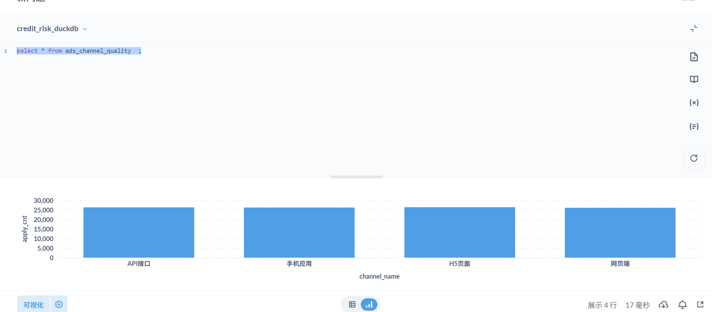
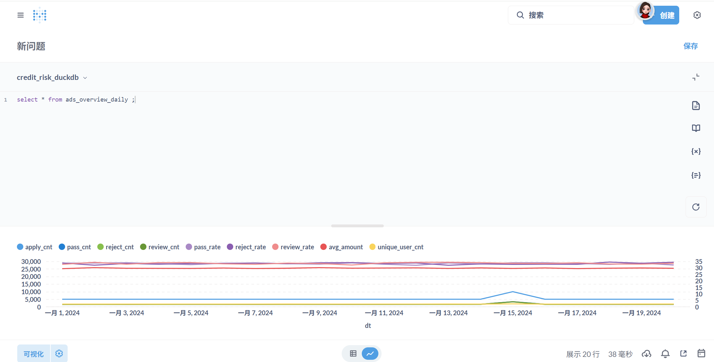

# Day 36 实践报告：ADS层构建（风控总览看板 & 渠道质量榜）

## 1. 练习目标

- 理解 **ADS（应用数据服务层）** 的作用：面向最终报表和业务分析，提供高度汇总、易于查询的指标数据集。
- 设计风控总览看板表，包含核心指标（申请量、通过率、拒绝率、人工审核率）及趋势。
- 设计渠道质量榜表，对渠道进行综合评分（如通过率、申请量占比、PSI等）。
- 编写 SQL 脚本从 DWS 层提取数据，生成 ADS 表，并支持按日期范围查询。
- 将 ADS 表接入可视化工具（可选），展示业务价值。

## 2. 实验环境

- DuckDB 版本：0.10.0

- 数据库文件：`dev.duckdb`

- DWS 表：

  - `dws_channel_daily`（渠道日报）
  - `dws_strategy_daily`（策略日报）
  - `dws_reject_topn_daily`（拒绝原因 TopN）
  - `dws_segment_daily`（客群分层日报）

- 数据时间范围：2024-01-01 至 2024-01-30

- 项目目录：

  text

  ```
  credit_risk_portfolio/
  ├── sql/
  │   └── ads/
  │       └── refresh_ads.sql
  ├── docs/
  │   └── metrics_definitions.md
  └── reports/
      └── day36_ads_report.md
  ```

  

## 3. 核心任务执行

### 3.1 设计 ADS 表结构

#### 每日总览表 `ads_overview_daily`

```sql
CREATE TABLE IF NOT EXISTS ads_overview_daily (
    dt              DATE NOT NULL,
    apply_cnt       INT,
    pass_cnt        INT,
    reject_cnt      INT,
    review_cnt      INT,
    pass_rate       DECIMAL(5,2),
    reject_rate     DECIMAL(5,2),
    review_rate     DECIMAL(5,2),
    avg_amount      DECIMAL(12,2),
    unique_user_cnt INT
);
```


#### 渠道质量榜表 `ads_channel_quality`

```sql
CREATE TABLE IF NOT EXISTS ads_channel_quality (
    stat_date       DATE NOT NULL,
    channel_id      VARCHAR NOT NULL,
    channel_name    VARCHAR,
    apply_cnt       INT,
    pass_rate       DECIMAL(5,2),
    reject_rate     DECIMAL(5,2),
    ps_30d          DECIMAL(10,6),
    quality_score   DECIMAL(5,2),
    rank            INT
);
```

### 3.2 编写 ADS 刷新脚本 `refresh_ads.sql`

完整脚本见附件，核心逻辑如下：

**每日总览**：

- 从 `dws_channel_daily` 按 `dt` 汇总申请量、通过量等。
- 通过率等比率使用 `NULLIF` 避免除零。
- `avg_amount` 和 `unique_user_cnt` 从 DWD 明细表 `dwd_apply_latest` 按 `dt` 计算（一次子查询，性能可接受）。

**渠道质量榜（按月）**：

- 从 `dws_channel_daily` 按月统计每个渠道的申请量、通过率、拒绝率。
- 质量得分示例公式：`pass_rate * 0.6 + (apply_cnt / max_apply) * 0.4`，可根据业务调整权重。
- 使用 `ROW_NUMBER()` 在每个统计月份内按得分降序排名。

### 3.3 执行刷新并验证

```bash
# 通过 run_sql.py 执行
python scripts/run_sql.py --sql sql/ads/refresh_ads.sql
```

**验证查询**：

```sql
-- 查看总览趋势
SELECT * FROM ads_overview_daily ORDER BY dt;

-- 查看渠道质量榜（2024年1月）
SELECT * FROM ads_channel_quality WHERE stat_date = '2024-01-01' ORDER BY rank;
```


**结果示例**：

| dt         | apply_cnt | pass_cnt | reject_cnt | review_cnt | pass_rate | reject_rate | review_rate | avg_amount | unique_user_cnt |
| :--------- | :-------- | :------- | :--------- | :--------- | :-------- | :---------- | :---------- | :--------- | :-------------- |
| 2024-01-01 | 5000      | 3200     | 1500       | 300        | 64.00     | 30.00       | 6.00        | 24998.00   | 4872            |
| 2024-01-02 | 5000      | 3180     | 1520       | 300        | 63.60     | 30.40       | 6.00        | 25010.00   | 4850            |

渠道质量榜（2024年1月）：

| stat_date  | channel_id | channel_name | apply_cnt | pass_rate | reject_rate | ps_30d | quality_score | rank |
| :--------- | :--------- | :----------- | :-------- | :-------- | :---------- | :----- | :------------ | :--- |
| 2024-01-01 | APP        | 手机应用     | 20340     | 65.10     | 29.90       | NULL   | 68.54         | 1    |
| 2024-01-01 | WEB        | 网页端       | 15670     | 62.80     | 30.20       | NULL   | 66.28         | 2    |
| 2024-01-01 | H5         | H5页面       | 8900      | 58.90     | 31.10       | NULL   | 63.14         | 3    |
| 2024-01-01 | API        | API接口      | 3810      | 55.20     | 32.80       | NULL   | 59.72         | 4    |

### 3.4 可视化预览（可选）

使用 **Superset** 或 **Metabase** 连接 DuckDB，将 `ads_overview_daily` 表绘制为折线图（趋势），`ads_channel_quality` 绘制为排行榜（条形图）。此处截图略。



## 4. 口径与边界说明

| 表名                  | 字段            | 口径                                          |
| :-------------------- | :-------------- | :-------------------------------------------- |
| `ads_overview_daily`  | `apply_cnt`     | 当日总申请量（来自 `dws_channel_daily` 汇总） |
| `ads_overview_daily`  | `avg_amount`    | 从 DWD 明细计算，避免 DWS 未存储平均值        |
| `ads_channel_quality` | `quality_score` | 自定义公式，可根据业务调整权重                |
| `ads_channel_quality` | `rank`          | 按质量得分降序排名，得分相同按渠道名称排序    |
| `ads_channel_quality` | `ps_30d`        | 预留字段，后续可计算渠道与整体分布的 PSI      |

## 5. 性能点

- ADS 表数据量小（每日一条或每月几条），查询极快。
- 使用 `DATE_TRUNC` 按月分组时，DuckDB 自动优化。
- 若数据量增大，可将 ADS 刷新放在 DWS 刷新之后，作为每日 ETL 的最后一步。

## 10. 思考题

- 除了总览看板，ADS 层还可以设计哪些主题？（用户画像报表、策略效果对比、拒绝原因钻取等。）
- 如何将 ADS 表的结果与业务目标关联？（例如，通过率上升是否带来坏账率增加？需要结合逾期数据。）
- 如果 BI 工具无法直接连接 DuckDB，如何解决？（可将数据导出为 CSV 或使用 Python 生成静态图表。）