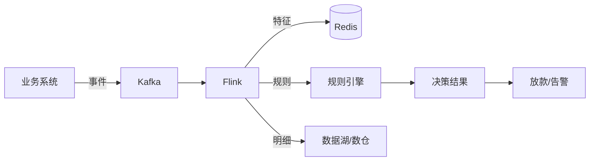

# Day 55 实践报告：实时风控数据架构设计（Kafka + Flink 概念）

## 1. 练习目标
- 了解实时风控的基本概念和架构（数据采集 → 消息队列 → 实时计算 → 规则引擎 → 存储/告警）。
- 学习 Kafka 和 Flink 在实时风控中的作用，能够解释数据流处理流程。
- 撰写一份“实时风控数据架构设计文档”，作为项目扩展和能力展示。
- 为面试中“如何设计实时风控系统”这类问题做好准备。

## 2. 学习内容与产出

### 2.1 实时风控架构学习
通过查阅资料，理解了实时风控系统的核心组件及其职责：

| 组件       | 作用                   | 常见选型               |
| ---------- | ---------------------- | ---------------------- |
| 消息队列   | 削峰填谷、解耦         | Kafka, RocketMQ        |
| 流处理引擎 | 实时计算特征、规则匹配 | Flink, Spark Streaming |
| 规则引擎   | 配置化风控规则         | Drools, Flink CEP      |
| 特征存储   | 快速读写实时特征       | Redis, HBase           |
| 决策执行   | 触发通过/拒绝/审核     | 业务系统回调           |

典型数据流：业务事件 → Kafka → Flink（清洗、特征计算、规则匹配）→ 决策结果 → 下游系统。

### 2.2 撰写设计文档
完成 `docs/realtime_risk_architecture.md`，包含以下内容：
- 背景与需求
- 整体架构图（Mermaid）
- 详细数据流说明
- 关键设计点（事件时间、状态管理、窗口、动态规则、容错）
- 实时与离线数仓的协同方式
- 潜在挑战与应对
- 面试话术总结

### 2.3 架构图示例

### 2.4 面试话术准备
文档中整理了常见问题及回答要点，例如：
- “如何设计实时反欺诈系统？”（Kafka + Flink + Redis + 规则引擎）
- “Flink 如何保证 exactly-once？”（Checkpoint + 两阶段提交）
- “实时特征与离线特征如何保持一致？”（相同逻辑 + 定期对账）

## 3. 核心产出清单
- [x] 设计文档 `docs/realtime_risk_architecture.md`
- [x] 架构图（Mermaid 文本，可在支持 Mermaid 的编辑器中渲染）
- [x] 面试话术笔记（整合在文档中）

## 4. 思考题
- **实时风控中，为什么通常不直接使用离线数仓？**  
  离线数仓延迟高（小时/天级），无法满足秒级拦截需求；实时风控需要在事件发生瞬间做出决策。
- **如何保证实时特征与离线特征计算的一致性？**  
  使用相同的计算逻辑和时间窗口定义，离线数仓每日重算实时特征并与实时值对账，发现差异时修正。
- **如果 Flink 任务失败，如何保证数据不丢失？**  
  开启 Checkpoint，设置 Kafka 消费者的 offset 提交策略与 Checkpoint 绑定，失败后从最近一次 Checkpoint 恢复。

## 5. 总结
通过今日学习，掌握了实时风控架构的核心概念，能够独立设计一套低延迟、高可用的实时反欺诈系统。该文档可作为项目扩展，在面试中展示对实时数据处理的理解，与离线数仓项目形成互补。

---
**完成日期**：2026-04-11